### 说明：此博客是徐俊发表在郭霖公众号的一篇文章，在这里拿过来发表第一篇文章

徐俊 的博客地址：

http://blog.csdn.net/gdutxiaoxu

## 大概可以分为以下几个步骤
1. 搭建环境准备（包括 node.js 和 git 环境，gitHub 账户的配置）
2. 安装Hexo
3. 配置Hexo
4. 怎样将 Hexo 与 github page 联系起来
5. 怎样发布文章
6. 主题推荐
7. 主题Net的简单配置
8. 添加 sitemap 和 feed 插件
9. 添加 404 公益页面

### 搭建环境准备
	* Node.js的安装和准备
	* Git 的安装和准备
	* gitHub 账户的配置

#### 配置Node.js环境
下载Node.js安装文件：
>  Windows Installer 32-bit
https://nodejs.org/dist/v4.2.3/node-v4.2.3-x86.msi

>  Windows Installer 64-bit
https://nodejs.org/dist/v4.2.3/node-v4.2.3-x64.msi

根据自己的Windows版本选择相应的安装文件，要是不知道，就安装32-bit的吧。 如图所示：
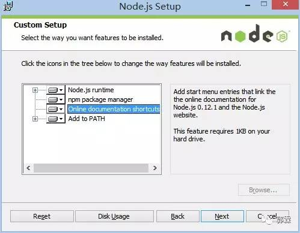
保持默认设置即可，一路Next，安装很快就结束了。 然后我们检查一下是不是要求的组件都安装好了，同时按下 Win 和 R，打开运行窗口：
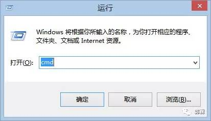
在新打开的窗口中输入cmd，敲击回车，打开命令行界面。（下文将直接用打开命令行来表示以上操作，记住哦~） 在打开的命令行界面中，输入：
node -v
npm -v
如果结果如下图所示，则说明安装正确，可以进行下一步了，如果不正确，则需要回头检查自己的安装过程。
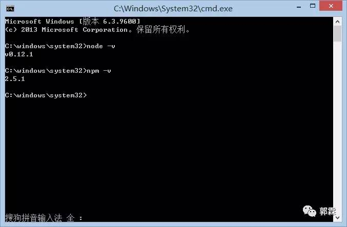

#### 配置Git环境
下载Git安装文件：
> https://git-scm.com/downloads
然后就进入了Git的安装界面，如图：
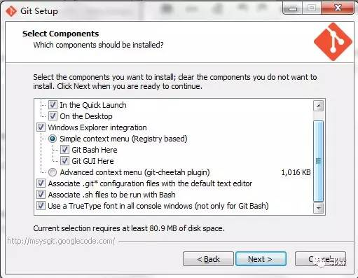
和 Node.js 一样，大部分设置都只需要保持默认，但是出于我们操作方便考虑，建议 PATH 选项按照下图选择：
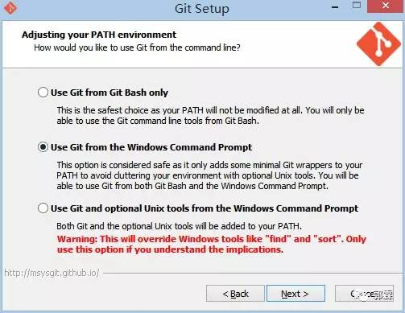
这是对上图的解释，不需要了解请直接跳过 Git 的默认设置下，出于安全考虑，只有在 Git Bash 中才能进行 Git 的相关操作。按照上图进行的选择，将会使得 Git 安装程序在系统 PATH 中加入 Git 的相关路径，使得你可以在 CMD 界面下调用 Git，不用打开 Git Bash 了。
一样的，我们来检查一下Git是不是安装正确了，打开命令行，输入：
git --version
如果结果如下图所示，则说明安装正确，可以进行下一步了，如果不正确，则需要回头检查自己的安装过程。

#### github账户的注册和配置
* 如果已经拥有账号，请跳过此步~
1. Github注册
打开 https://github.com ，在下图的框中，分别输入自己的用户名，邮箱，密码。

然后前往自己刚才填写的邮箱，点开 Github 发送给你的注册确认信，确认注册，结束注册流程。一定要确认注册，否则无法使用gh-pages！
2. 创建代码库
登陆之后，点击页面右上角的加号，选择 New repository：
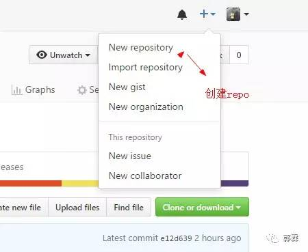
3. 新建代码库
进入代码库创建页面：
在 Repository name下填写 yourname.github.io，Description (optional) 下填写一些简单的描述（不写也没有关系），如图所示：
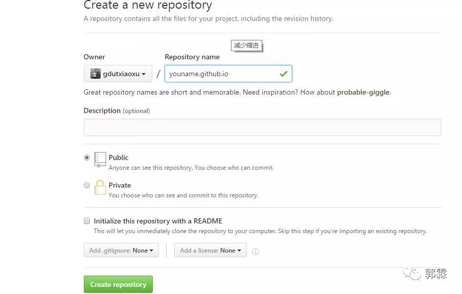
注意：比如我的 github 名称是 gdutxiaoxu ,这里你就填 gdutxiaoxu.github.io,如果你的名字是 xujun，那你就填 xujun.github.io
4. 代码库设置
正确创建之后，你将会看到如下界面：
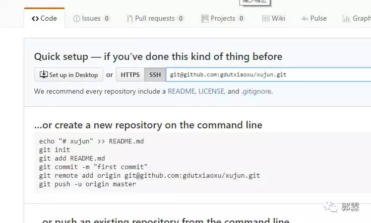
接下来开启 gh-pages 功能，点击界面右侧的 Settings，你将会打开这个库的 setting 页面，向下拖动，直到看见 GitHub Pages，如图：
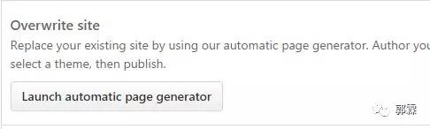
点击 Automatic page generator，Github 将会自动替你创建出一个 gh-pages 的页面。 如果你的配置没有问题，那么大约15分钟之后，yourname.github.io 这个网址就可以正常访问了~ 如果 yourname.github.io 已经可以正常访问了，那么 Github 一侧的配置已经全部结束了。

到此搭建 Hexo博客 的相关环境配置已经完成，下面开始讲解 Hexo 的相关配置。

### 安装Hexo

在自己认为合适的地方创建一个文件夹，这里我以E：/hexo 为例子讲解，首先在E盘目录下创建Hexo文件夹，并在命令行的窗口进入到该目录：
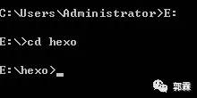
在命令行中输入：
npm install hexo-cli -g
然后你将会看到:
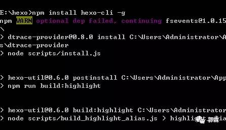
可能你会看到一个WARN，但是不用担心，这不会影响你的正常使用。 然后输入：
npm install hexo --save
然后你会看到命令行窗口刷了一大堆白字，下面我们来看一看Hexo是不是已经安装好了。 在命令行中输入：
hexo -v
如果你看到了如图文字，则说明已经安装成功了。
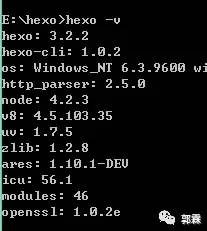

### Hexo相关配置
1. 初始化Hexo
接着上面的操作，输入：
hexo init
然后输入：
npm install
之后 npm 将会自动安装你需要的组件，只需要等待 npm 操作即可。
2. 首次体验Hexo
继续操作，同样是在命令行中，输入：
hexo g
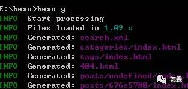
然后输入：
hexo s
然后会提示：
INFO Hexo is running at http://0.0.0.0:4000/. Press Ctrl+C to stop.
在浏览器中打开 http://localhost:4000，你将会看到：
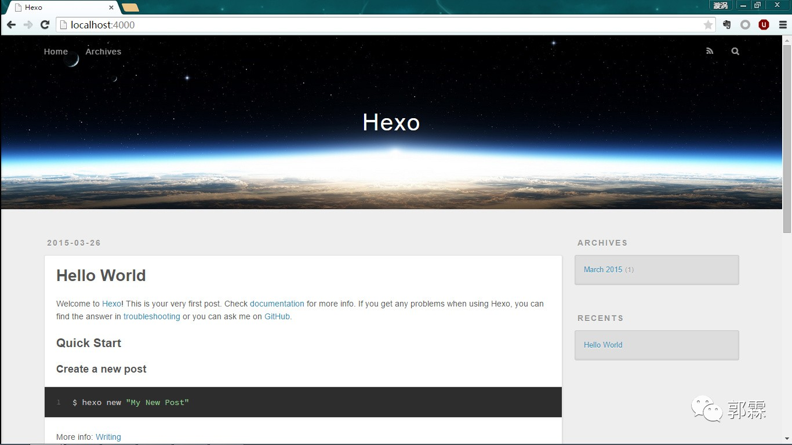
到目前为止，Hexo在本地的配置已经全都结束了。下面会讲解怎样将 Hexo 与 github page 联系起来。

### 将Hexo与github page 联系起来
#### 配置Git个人信息

*如果你之前已经配置好git个人信息，请跳过这个步骤
设置 Git 的 user name 和 email：(如果是第一次的话)
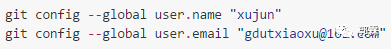
*生成密钥
ssh-keygen -t rsa -C "gdutxiaoxu@163.com"

#### 配置Deployment
同样在 _config.yml 文件中，找到 Deployment，然后按照如下修改：
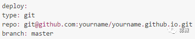

### 写博客、发布文章
新建一篇博客，执行下面的命令：
hexo new post "article title"
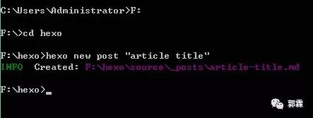
这时候在我的 电脑的目录下 F:\hexo\source_posts 将会看到 article title.md 文件
用MarDown编辑器打开就可以编辑文章了。文章编辑好之后，运行生成、部署命令：
hexo g // 生成
hexo d // 部署
当然你也可以执行下面的命令，相当于上面两条命令的效果：
hexo d -g #在部署前先生成
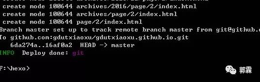

踩坑提醒
1. 注意需要提前安装一个扩展：
npm install hexo-deployer-git --save
2. 如果出现下面这样的错误：
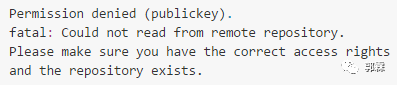
则是因为没有设置好public key所致。在本机生成public key,不懂的可以参考这一篇博客：
Git ssh 配置及使用
http://blog.csdn.net/gdutxiaoxu/article/details/53573399

### 主题推荐

每个不同的主题会需要不同的配置，主题配置文件在主题目录下的 _config.yml。有两个比较好的主题推荐给大家。
Yilia
http://litten.me
Yilia 是为 hexo 2.4+制作的主题。崇尚简约优雅，以及极致的性能。
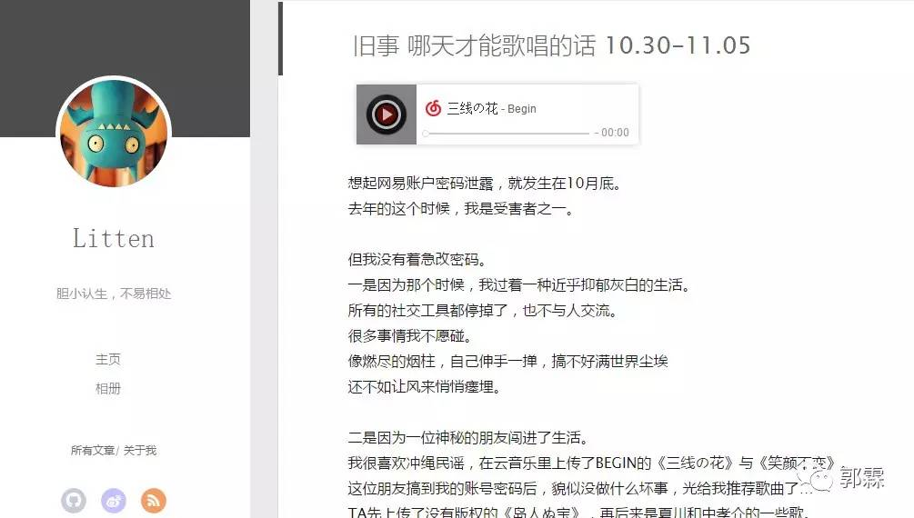

NexT
我的网站就是采用这个主题，简洁美观。目前Github上Star最高的Hexo主题，支持几种不同的风格。作者提供了非常完善的配置说明。

### Net主题的配置
NexT
http://theme-next.iissnan.com/getting-started.html

在 Hexo 中有两份主要的配置文件，其名称都是 _config.yml。 其中，一份位于站点根目录下，主要包含 Hexo 本身的配置；另一份位于主题目录下，这份配置由主题作者提供，主要用于配置主题相关的选项。

为了描述方便，在以下说明中，将前者称为 站点配置文件， 后者称为 主题配置文件。

比如我的电脑下的 F:\hexo 目录下的成为 站点配置文件，F:\hexo\themes\next 目录下的成为主题配置文件。

1. 安装 NexT

Hexo 安装主题的方式非常简单，只需要将主题文件拷贝至站点目录的 themes 目录下， 然后修改下配置文件即可。具体到 NexT 来说，安装步骤如下。

如果你熟悉 Git， 建议你使用 克隆最新版本 的方式，之后的更新可以通过 git pull 来快速更新， 而不用再次下载压缩包替换。

在终端窗口下，定位到 Hexo 站点目录下。使用 Git 命令：
cd your-hexo-site
git clone https://github.com/iissnan/hexo-theme-next.git
2. 启用主题

与所有 Hexo 主题启用的模式一样。 当 克隆/下载 完成后，打开 站点配置文件， 找到 theme 字段，并将其值更改为 next。启用 NexT 主题：

theme: next
到此，NexT 主题安装完成。下一步我们将验证主题是否正确启用。在切换主题之后、验证之前， 我们最好使用 hexo clean 来清除 Hexo 的缓存。

3. 验证主题

首先启动 Hexo 本地站点，并开启调试模式（即加上 –debug），整个命令是 hexo s –debug。 在服务启动的过程，注意观察命令行输出是否有任何异常信息，如果你碰到问题，这些信息将帮助他人更好的定位错误。 当命令行输出中提示出：

INFO Hexo is running at http://0.0.0.0:4000/. Press Ctrl+C to stop.
此时即可使用浏览器访问 http://localhost:4000 ，检查站点是否正确运行。

当你看到站点的外观与下图所示类似时即说明你已成功安装 NexT 主题。这是 NexT 默认的 Scheme —— Muse
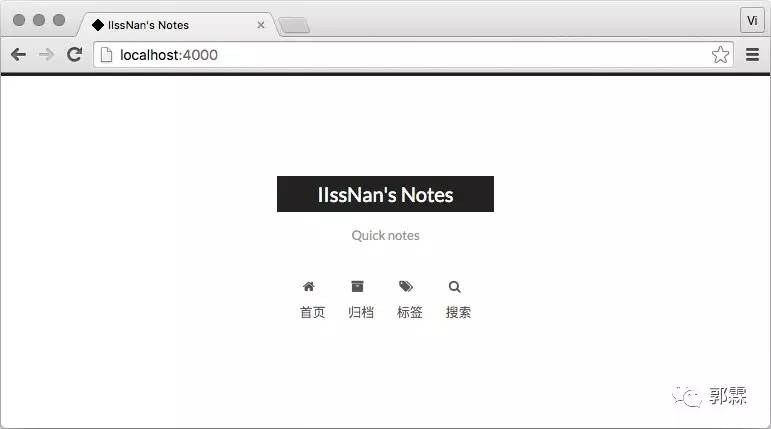
现在，你已经成功安装并启用了 NexT 主题。下一步我们将要更改一些主题的设定，包括个性化以及集成第三方服务。

4. 主题设定

选择 Scheme

Scheme 是 NexT 提供的一种特性，借助于 Scheme，NexT 为你提供多种不同的外观。同时，几乎所有的配置都可以 在 Scheme 之间共用。目前 NexT 支持三种 Scheme，他们是：

Muse - 默认 Scheme，这是 NexT 最初的版本，黑白主调，大量留白

Mist - Muse 的紧凑版本，整洁有序的单栏外观

Pisces - 双栏 Scheme，小家碧玉似的清新

Scheme 的切换通过更改 主题配置文件，搜索 scheme 关键字。 你会看到有三行 scheme 的配置，将你需用启用的 scheme 前面

注释 # 即可。

选择 Pisce Scheme

#scheme: Muse
#scheme: Mist
scheme: Pisces
5. 设置语言

编辑 站点配置文件， 将 language 设置成你所需要的语言。建议明确设置你所需要的语言，例如选用简体中文，配置如下：

language: zh-Hans
目前 NexT 支持的语言如以下表格所示：
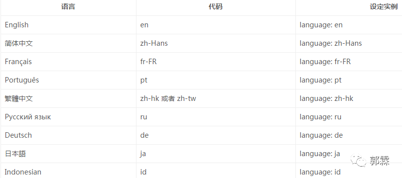
6. 设置菜单

菜单配置包括三个部分，第一是菜单项（名称和链接），第二是菜单项的显示文本，第三是菜单项对应的图标。 NexT 使用的是 Font Awesome 提供的图标， Font Awesome 提供了 600+ 的图标，可以满足绝大的多数的场景，同时无须担心在 Retina 屏幕下 图标模糊的问题。

编辑 主题配置文件，修改以下内容：

设定菜单内容，对应的字段是 menu。 菜单内容的设置格式是：item name: link。其中 item name 是一个名称，这个名称并不直接显示在页面上，她将用于匹配图标以及翻译。

菜单示例配置：
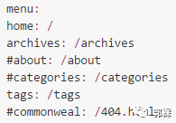
若你的站点运行在子目录中，请将链接前缀的 / 去掉

NexT 默认的菜单项有（标注 的项表示需要手动创建这个页面）：
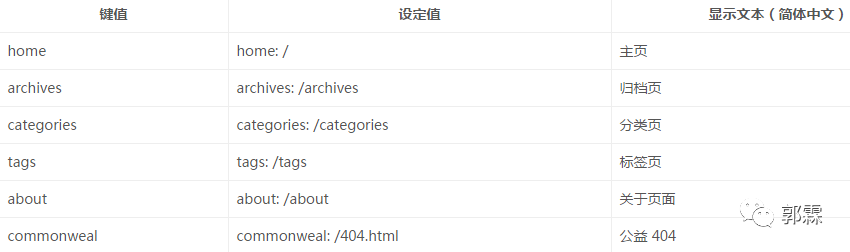
设置菜单项的显示文本。在第一步中设置的菜单的名称并不直接用于界面上的展示。Hexo 在生成的时候将使用 这个名称查找对应的语言翻译，并提取显示文本。这些翻译文本放置在 NexT 主题目录下的 languages/{language}.yml （{language} 为你所使用的语言）。

以简体中文为例，若你需要添加一个菜单项，比如 something。那么就需要修改简体中文对应的翻译文件 languages/zh-Hans.yml，在 menu 字段下添加一项：

menu:home: 首页
archives: 归档
categories: 分类
tags: 标签
about: 关于
search: 搜索
commonweal: 公益404
something: 有料
设定菜单项的图标，对应的字段是 menu_icons。 此设定格式是 item name: icon name，其中 item name 与上一步所配置的菜单名字对应，icon name 是 Font Awesome 图标的 名字。而 enable 可用于控制是否显示图标，你可以设置成 false 来去掉图标。

菜单图标配置示例

menu_icons:enable: true
# Icon Mapping.
home: home
about: user
categories: th
tags: tags
archives: archive
commonweal: heartbeat
在菜单图标开启的情况下，如果菜单项与菜单未匹配（没有设置或者无效的 Font Awesome 图标名字） 的情况下，NexT 将会使用 作为图标。

请注意 键值（如 home）的大小写要严格匹配

7. 侧栏

默认情况下，侧栏仅在文章页面（拥有目录列表）时才显示，并放置于右侧位置。 可以通过修改 主题配置文件 中的 sidebar 字段来控制侧栏的行为。侧栏的设置包括两个部分，其一是侧栏的位置， 其二是侧栏显示的时机。

设置侧栏的位置，修改 sidebar.position 的值，支持的选项有：

left - 靠左放置
right - 靠右放置
目前仅 Pisces Scheme 支持 position 配置。影响版本5.0.0及更低版本。

sidebar:
position: left
设置侧栏显示的时机，修改 sidebar.display 的值，支持的选项有：
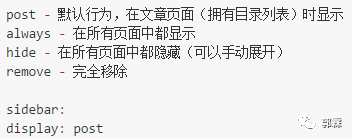
已知侧栏在 use motion: false 的情况下不会展示。 影响版本5.0.0及更低版本。

8. 设置头像

编辑 站点配置文件， 新增字段 avatar， 值设置成头像的链接地址。其中，头像的链接地址可以是：

完整的互联网 URI：http://example.com/avtar.png

站点内的地址：将头像放置主题目录下的 source/uploads/ （新建uploads目录若不存在） 配置为：avatar: /uploads/avatar.png 或者 放置在 source/使用hexo+github搭建自己的博客/images/ 目录下 , 配置为：avatar: /使用hexo+github搭建自己的博客/images/avatar.png

9. 设置 作者昵称

编辑 站点配置文件， 设置 author 为你的昵称。

10. 站点描述

编辑 站点配置文件， 设置字段为你的站点描述。站点描述可以是你喜欢的一句签名:)

### 添加插件
添加 sitemap 和 feed 插件。切换到你本地的 hexo 目录CIA，在命令行窗口，输入以下命令：
npm install hexo-generator-feed -save
npm install hexo-generator-sitemap -save

修改 _config.yml，增加以下内容：
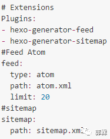
再执行以下命令，部署服务端：

hexo d -g
配完之后，就可以访问 https://gdutxiaoxu.github.io/atom.xml 和 https://gdutxiaoxu.github.io/sitemap.xml ，发现这两个文件已经成功生成了。

### 添加404页面
GitHub Pages有提供制作404页面的指引：

Custom 404 Pages 
https://help.github.com/articles/creating-a-custom-404-page-for-your-github-pages-site

直接在根目录下创建自己的 404.html 或者 404.md 就可以。但是自定义404页面仅对绑定顶级域名的项目才起作用，GitHub默认分配的二级域名是不起作用的，使用 hexo server 在本机调试也是不起作用的。

推荐使用，腾讯公益404：

http://www.qq.com/404
我的404页面配置如下：
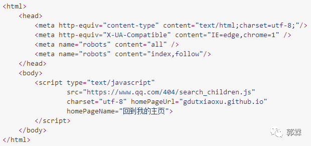

### 参考

Hexo主页
https://hexo.io

史上最详细的Hexo博客搭建图文教程
https://xuanwo.org/2015/03/26/hexo-intor

